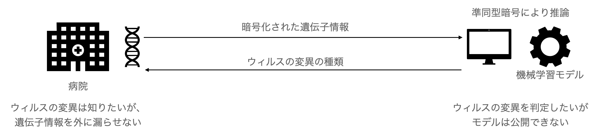
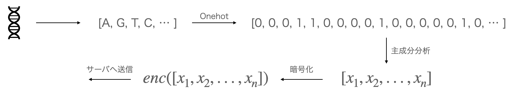

# 暗号化したまま機械学習！ 秘密計算を使ったRNAの分類 IDASH 2021より
こんにちは、秘密計算エンジニアをしている山口です。  
今回は近年注目を集める、準同型暗号の基礎からCKKS schemeによる準同型暗号を使った機械学習までを、  
セキュリティのワークショップであるIDASH 2021の準同型暗号を使ってウィルスの変異を分類するコンペティションを軸としながら、
幅広く解説していきたいと思います。

## コンペの概要


コンペのターゲットは、病院から送られてきたウィルスの塩基配列(A, T, G, Cからなる30000程度の長さの配列)を、ウィルスの変異を4つのクラスに分類するというものでした。  

病院はウィルスがどの変異なのかを知りたいのですが、その遺伝子情報を外に漏らすことはできません。その一方で、分析会社の方はモデルを外に公開できないという事情があります。

そのため、病院側で暗号化した遺伝子情報を、サーバ側で暗号化したまま推論、つまり準同型暗号を使った推論を行い、その結果を暗号化したまま病院に返し、病院側で復号し結果を得る必要があります。  

ただし、病院側での簡単な前処理は許されていました。
そこで、A,T,G,Cをそれぞれone-hot vectorに変換して、主成分分析により200次元までまず圧縮し、それを暗号化してサーバ側に送ることにしました。



サーバ側では、学習済みのロジスティック回帰のモデルを適用し、４クラスに分類するというアプローチで取り組みました。

以上のように作成したモデルにより、98%の精度でウィルスの変異を分類することができました。   

以下では、
- 準同型暗号とは何か
- 準同型暗号を使ってどのように推論したのか

について述べたいと思います。 


## 準同型暗号
準同型とは、ふたつの集合が数学的性質において同一になるというものを示しています。

定義は、
群$G_1$, $G_2$を結ぶ写像$\phi : G_1 \rightarrow G_2$として定義した時に、

$$
\exist x,y \in G_1 \Rightarrow \phi(xy) = \phi(x)\phi(y) 
$$

となる性質を言います。  

このような状況は実はあまりないのですが、$\Z$上の恒等写像がこれに当てはまります。他にも、正の実数の掛け算が対数における足し算として表される関係も準同型と言えます。  

この性質を暗号に適用したのが準同型暗号です。

平文における演算$xy$が暗号文における$\phi(x)\phi(y)$と一致するという性質を満たすことができれば、暗号化したままの演算、秘密計算が可能となるのです。

### RSA暗号は積に関して準同型  
実は、ssh鍵にも使われるRSA暗号は積に関して準同型なのです。

ある大きな素数$p, q$を用意し、$n = pq$として、剰余環$\Z/n\Z = \{1, 2, ..., n-1\}$を考える。 オイラーの関数より、剰余環の元の数は$\varphi(n) = (p-1)(q-1)$となる。

整数$e$を適切に定めて、

$$
ed \equiv 1 \ \mod \phi(n)
$$

をユークリッド互助法により計算する。$e$は公開鍵、$d$は秘密鍵として用いる。  

あるメッセージ$M_1$, $M_2$を暗号化して掛け算することを考える。

暗号化は

$$
C_1 = M_1^e,\ C_2 = M_2^e
$$

として行う。  
続いて、これらの積を取る。  
$$
C_{mult} = C_1  C_2 = M_1^e M_2^e = (M_1 M_2)^e
$$

お気づきの通り、これは準同型の性質を満たしていることがわかる（平文での$M_1 M_2$を暗号化すれば同様に$(M_1M_2)^e$となるため。

復号時には以下を計算する。

$$
C_{mult}^d = (M_1 M_2)^{ed} = (M_1 M_2)^{\phi(n)m+1}
$$
ただし、$m \in \Z_{>0}$である。  

ここで、オイラーの定理により$M^{\phi(n)} \equiv 1 \mod n$ となるので、

$$
(M_1 M_2)^{\phi(n)m+1} = ((M_1 M_2)^\phi(n))^m(M_1M_2) = M_1M_2 \mod n
$$

なお、大きな整数$N$の素因数分解を求めるのはNP困難なので、秘密鍵なしに平文を求めるのは困難である

以上のような積に関して自由に演算可能な暗号を乗法準同型暗号という。

## 実数の乗法・加法を扱うことができるCKKS scheme
今回のコンペで行いたい線形回帰では、ベクトルのドット積が必要になります。これを計算するには、各要素に関する足し算と掛け算が行われる必要があるため、完全準同型暗号が必要になります。  

それを可能にしたものの一つにCKKSがあります。この暗号では、符号付き固定小数点実数を扱うことができます。  
さらに、CRT(Chinese Remainder Theorem: 中国剰余定理) packing という手法を使うことで、複数の数値を一つの多項式に埋めた上で、演算を行い、ベクトル同士の要素積や要素和を計算することができます。  

CKKSスキームについてはかなり難解なので、別記事で解説することとします。  

### CKKSの特徴
CKKSには以下の特徴があるため、機械学習の推論に適している
- 乗法・加法を使ったleveled homomorphic encryptionが可能であり、複数回の演算が可能
- CRT packingにより、ベクトルの要素演算ができる
- ベクトルのrotationができる（ガロア拡大・回転を利用している）
- noiseを加えてセキュアにするが、そのノイズが平文にもかかるため、金融など正確な演算には向かないが、多少のノイズを許容する機械学習には向いている

## コンペを解く： CKKSを使った線形回帰の推論
今回は暗号空間で行うメソッドは線形回帰のドット積の部分とし、それ以外の前処理はクライアント側で行う想定としました。
クライアント側で前処理されたベクトル$X={x_1, x_2, ..., x_n}$と重み$W={w_1, w_2, ..., w_n}$を暗号空間でかけることを考えます。ただし、4つのクラスに分類するので、重みは実際には3次元となります。ここでは簡単のために、2値分類として表します。

まず、ドット積は平文でどのように計算されるかというと、

$$
WX = w_1 x_1 + ... + w_n x_n
$$
となります。

これを暗号空間で計算します。(X', W'として暗号を表す)
まず、CKKSの要素積を計算します。ただし右辺は平文空間ではどうなっているのかを表しており、実際の暗号を表しているわけではないので注意です。

$$
W'X' = (w_1'x_1', ..., w_n'x_n')
$$

これの要素の総和を取る必要がありますが、CKKSではベクトル内での和はとれず、ベクトル同士の和しかとることができません。  
そこで、rotationメソッドと和を取ることを考えます。

rotationは以下のように定義します（第二引数は何要素分rotateするか）
$$
rot(W'X', 1) = (w_2'x_2', ..., w_n'x_n', w_1'x_1')
$$
これを足せば、
$$
W'X' + rot(W'X', 1) = (w_1'x_1' + w_2'x_2', ..., w_{n-1}'x_{n-1}' + w_n'x_n', w_1'x_1' + w_n'x_n')= 
$$
となります。これを繰り返していけば、第一要素に全ての要素の和が入ることになります。
擬似的には、
```python
mul = multiply(W, Y)
sum = mul
for i in 1 to n:
   sum = add(sum, rot(mul, i))
```
とすることで、ドット積が計算できます。  
なお、実際には$log_2(n)$回の演算で済むことが知られており、  

```python
mul = multiply(W, Y)
sum = mul
for i in 1 to log(n):
   sum = add(sum, rot(sum, i))
```
とすることで計算量を削減することができます。  

以上から、WXが計算され、これをクライアント側で復号し

$$
dec(W'X') = (w_1 x_1 + ... + w_n x_n, ...)
$$

この最初の要素を取り出せば、線形回帰の結果を得ることができます。  


## まとめ
以上により、目的としていた暗号化したままの分類を達成することができました。  

このメソッドでは残念ながら入賞することはできませんでしたが、応用範囲は広く、計算量も小さいため、使い勝手はよいものですので、今回のコンペへの参加は知見を得たという意味で良い成果が得られたと思います。  

今後は、CKKSスキームなどの高度な暗号アルゴリズムの詳細について解説できればと思います。

### 参考文献
- https://towardsdatascience.com/homomorphic-encryption-intro-part-3-encoding-and-decoding-in-ckks-69a5e281fee
- イデアル格子入門 https://www.iisec.ac.jp/proc/vol0006/arita14.pdf
- 代数学1 代数学2
